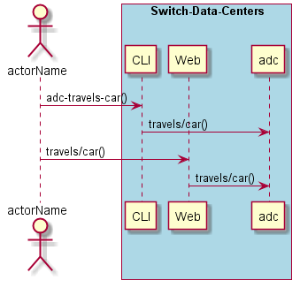
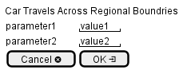

.. _Scenario-Car-Travels-Across-Regional-Boundries:

Car Travels Across Regional Boundries
=====================================

Car Travels Across Regional Boundries using CLI and Web Interface with ... <parameters>

**CLI**

This is the command line interface for the Car Travels Across Regional Boundries Scenario.

.. code-block:: none

  # adc travels car <parameters>
  # adc travels car exmaple

**Web Interface**

This is a mock up of the Web Interface for the Car Travels Across Regional Boundries Scenario.

**REST**

This is the RESTful interface for the scenario.

*travels/car*

============  ========  ===================
Name          Value     Description
------------  --------  -------------------
parameter1    value1    Description1
============  ========  ===================
