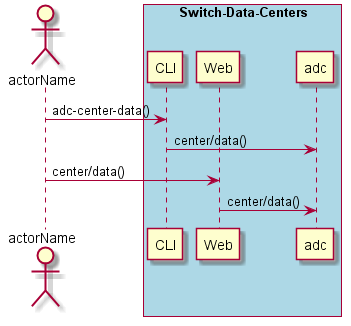
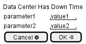

.. _Scenario-Data-Center-Has-Down-Time:

Data Center Has Down Time
=========================

Data Center Has Down Time using CLI and Web Interface with ... <parameters>

**CLI**

This is the command line interface for the Data Center Has Down Time Scenario.

.. code-block:: none

  # adc center data <parameters>
  # adc center data exmaple

**Web Interface**

This is a mock up of the Web Interface for the Data Center Has Down Time Scenario.

**REST**

This is the RESTful interface for the scenario.

*center/data*

============  ========  ===================
Name          Value     Description
------------  --------  -------------------
parameter1    value1    Description1
============  ========  ===================
