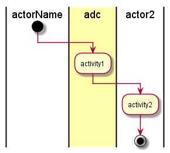

.. _UseCase-Transmit-Telemetry:

Transmit Telemetry
==================

Transmit Telemetry is a use case that allows the Automobile to transmit data to the Data Center.

Actors
------

* _Actors_

Activities
----------

* _Activities_

Systems Involved
----------------

* _Systems_

